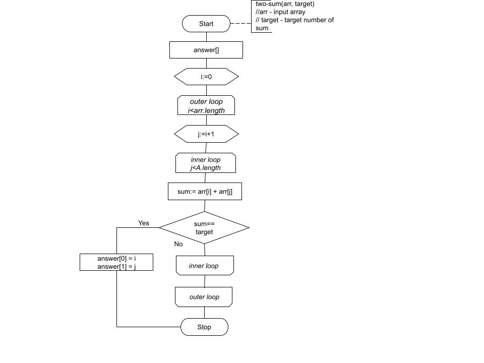

### Two Sum
### 1. The task
link to the problem on the website [leet code](https://leetcode.com/problems/two-sum/)

Given an array of integers `nums` and an integer `target`, return indices of the two numbers such that they add up to `target`.

You may assume that each input would have ___exactly one solution___, and you may not use the same element twice.

You can return the answer in any order.


__Example 1__:

```
Input: nums = [2,7,11,15], target = 9
Output: [0,1]
Output: Because nums[0] + nums[1] == 9, we return [0, 1].
```

__Example 2__:

```
Input: nums = [3,2,4], target = 6
Output: [1,2]
```
__Example 3__:

```
Input: nums = [3,3], target = 6
Output: [0,1]
```

Constraints:

-`2 <= nums.length <= 10^4`

-`10^9 <= nums[i] <= 10^9`

-`10^9 <= target <= 10^9`

-`Only one valid answer exists.`


__Follow-up__: Can you come up with an algorithm that is less than O(n<sup>2</sup>) time complexity?

###2. Solution
#### 2.1 Verbal description

Since at the moment I do not know the solution in time less than O(n<sup>2</sup>), 
so below I will describe a solution method in time O(n<sup>2</sup>) that iterates through the array using an internal loop.

#### 2.2 Pseudocode 

````
TWO_SUM(A, target)

> Input: array A, int target
> Output: array contains indices of array A, that two numbers such that they add up to target

answer[]
//outer loop
for i = 0 to A.length - 1
    //inner loop
    for j = i+1 to A.length - 1
        if A[i] + A[i+j] = target
            then answer[0] = i
                 answer[1] = j
return answer
````

### 3 Visualization
#### 3.1 Flow diagram


#### 3.2 Animation 

https://user-images.githubusercontent.com/38985170/218475295-a6a9e2c7-1a13-4723-a3af-d4c10dd6078b.mp4 

### 4. Analysis

For our algorithm, we introduce the time cost of each instruction and the number of their repetitions.

|  №  |                 Instructions                 | Cost |         Replays         |
|:---:|:--------------------------------------------:|:----:|:-----------------------:|
|     |        `int[] answers = new int[2];`         |  c0  |            1            |
|     |       `for(int i; i<nums.length; i++)`       |  c1  |            n            |
|     | `for (int j = i + 1; j < nums.length; j++)`  |  с2  |  $$\sum_{i=1}^n t_j$$   |
|     |      `if (nums[i] + nums[j] == target)`      |  с3  | $$\sum_{i=1}^n t_j-1$$  |
|     |               `answers[0] = i`               |  с4  | $$\sum_{i=1}^n t_j-1$$  |
|     |               `answers[1] = j`               |  с5  | $$\sum_{i=1}^n t_j-1$$  |

t<sub>j</sub> - the number of checks of the condition of the inner loop, which is equal to n-i at each iteration of the outer loop.

Since the condition check is performed 1 time more than the actions inside the inner loop, the number of operations inside the loop will be t<sub>j</sub>-1

From the formula for the sum of an arithmetic progression we have:
$$\sum_{i=1}^n t_j = {n(n+1)\over2}$$
Then
$$\sum_{i=1}^n t_j-1 = {n(n-1)\over2}$$ 

Thus, the total running time of the algorithm is:
$$с0 + с1n + c2 {(n(n+1)\over2} + c3 {(n(n-1)\over2} + c4 {(n(n-1)\over2} + c5{(n(n-1)\over2} = \left( {c2\over2} + {c3\over2} + {c4\over2} + {c5\over2} \right) n^2 + \left( c1 + {c2\over2} - {c3\over2} - {c4\over2} - {c5\over2} \right) n +  c0 $$ 

This time can be written in the form $$an^2 + bn + c$$

Thus, the order of growth of the function in the worst case is asymptotically equal to $$O \left(n^2\right)$$